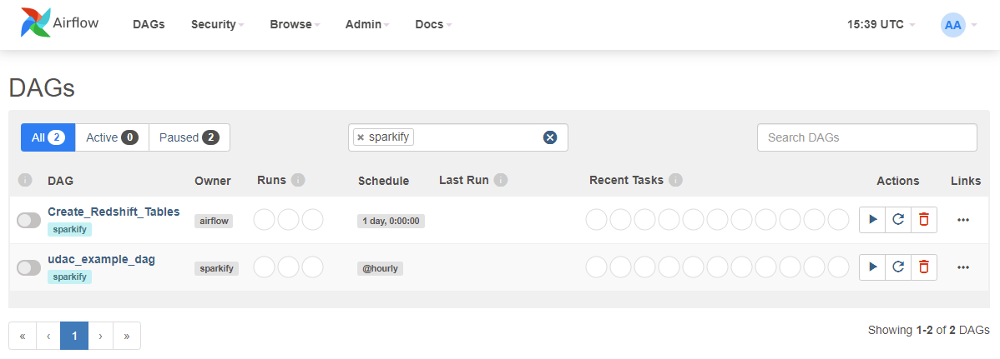
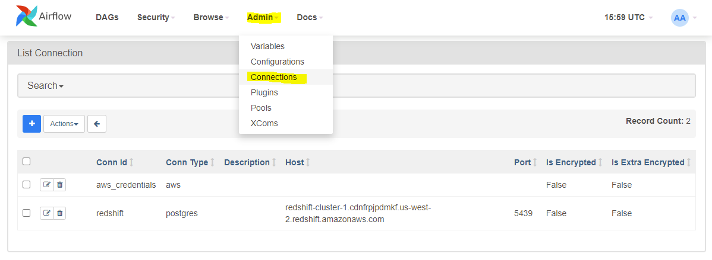
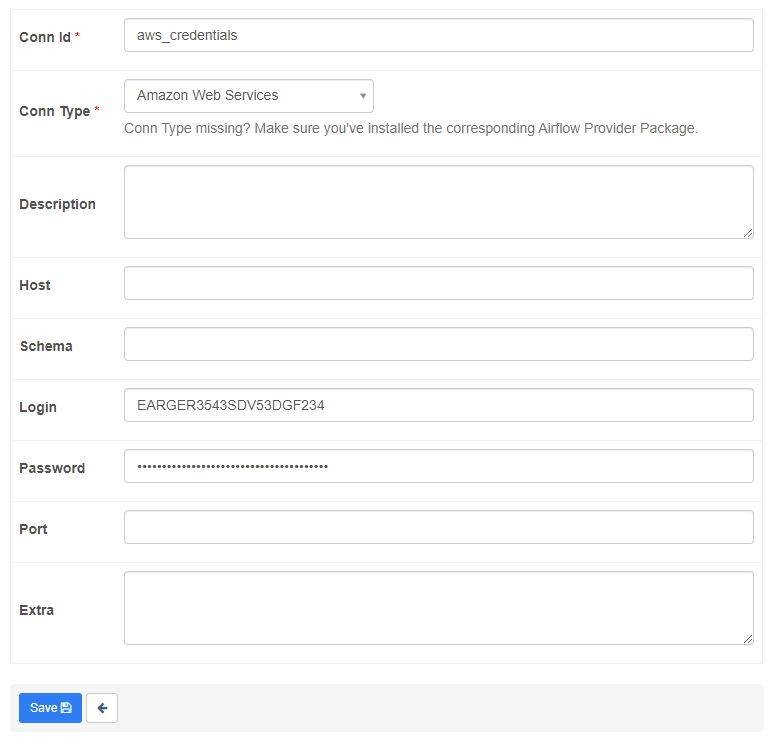
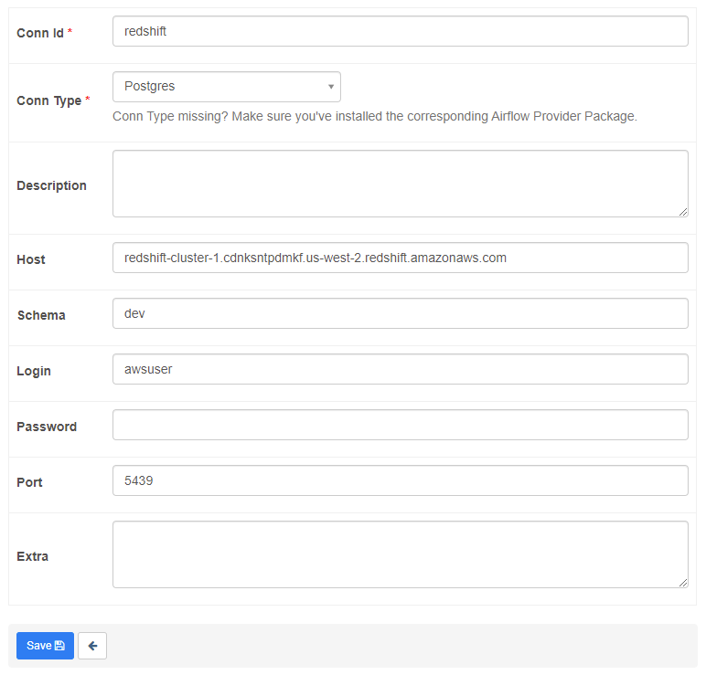

# Project: Data Pipelines with Airflow

## Project overview

A music streaming company, Sparkify, has decided that it is time to introduce more automation and monitoring to
their data warehouse ETL pipelines and come to the conclusion that the best tool to achieve this is Apache Airflow.

They have decided to bring you into the project and expect you to create high grade data pipelines that are dynamic
and built from reusable tasks, can be monitored, and allow easy backfills. They have also noted that the data quality
plays a big part when analyses are executed on top the data warehouse and want to run tests against their datasets after
the ETL steps have been executed to catch any discrepancies in the datasets.

The source data resides in S3 and needs to be processed in Sparkify's data warehouse in Amazon Redshift. 
The source datasets consist of JSON logs about user activity in the application and JSON metadata about the 
songs the users listen to.

## Running the project

### Prerequisites

- Apache Airflow service 
- Amazon Web Services credentials with S3 read permissions 
- Active AWS Redshift cluster 

### Apache Airflow

If you have an Apache Airflow environment running locally on your machine, you can of course drop the necessary DAG and
operator files from this repository into your Airflow directories. 

    Typical directory structure...
    ./dags                  # put your DAG files here.
    ./logs                  # logs from task execution and scheduler.
    ./plugins/operators     # put your custom operators here.

If you do not have a running Airflow environment, I would suggest running Airflow in a Docker container. Follow the
[**Docker Quick start**](https://airflow.apache.org/docs/apache-airflow/stable/start/docker.html) guidance to install
Docker and/or initialise an Airflow environment.

In short, After installing Docker desktop, download the Docker-Compose [**yaml**](https://airflow.apache.org/docs/apache-airflow/stable/docker-compose.yaml)
file to your project directory and initialise the environment by running the following commands via your terminal...

    airflow_project> docker-compose up airflow-init     # database migrations and set user account

    airflow_project> docker-compose up                  # start all services

Navigate your browser to **http://localhost:8080**, where you should be greeted with a log-in screen! 

<!--  -->

Should you have all project files in order, you should see the following DAGS, with no errors at the top of the page! 
*(filtered by 'sparkify' tag)*

## Configure Airflow connections

Prior to running any DAGs, you'll need to create 2 connections to AWS services.

**1) aws_credentials**

    - Conn Id:      # Enter 'aws_credentials'
    - Conn Type:    # Enter 'Amazon Web Services'
    - Login:        # Enter your Access key ID from your IAM User credentials
    - Password:     # Enter your Secret access key from your IAM User credentials

*example aws_credentials connection* 

**2) Redshift**

    - Conn Id:      # Enter 'redshift'
    - Conn Type:    # Enter 'Postgres'
    - Host:         # Enter the endpoint of your Redshift cluster. (Remove port from end)
    - Schema:       # Enter name of the Redshift database you want to connect to.
    - Login:        # Enter Redshift cluster Master Username
    - Password:     # Enter Redshift cluster database password
    - Port:         # Enter '5439'

*example Redshift connection* 

## Main DAG Overview

The DAG contains a default_args dictionary that sets the following rules:

- Does not have dependencies on past runs
- On failure, tasks are retried 3 times
- Retries happen every 5 minutes
- Catchup is turned off
- Does not email on retry

The DAG utilises 4 custom operators: 

- **StageToRedshiftOperator** 
  This staging operator loads JSON formatted files, app event logs and song metadata, stored in an S3 bucket to Redshift
  events and songs staging tables. S3 bucket keys, destination staging tables, and an SQL COPY statement are all 
  parameterised within the operator.
  

- **LoadFactOperator** 
This operator utilises an SQL helper class to load data from the staging tables to the destination fact table. The 
  destination table and SQL statement are both parameterised within the operator.
  

- **LoadDimensionOperator** 
This operator also utilises an SQL helper class to load data from the staging tables to the destination dimension 
  tables. The destination table and SQL statement are both parameterised within the operator.

- **DataQualityOperator** 
This operator runs checks on the fact and each dimension table to confirm the row count of each table against an 
  expected result. The DAG task holds a dictionary of tables to check and expected results for parsing to any of the 
  operator test cases.

*Working DAG with task dependencies set*

